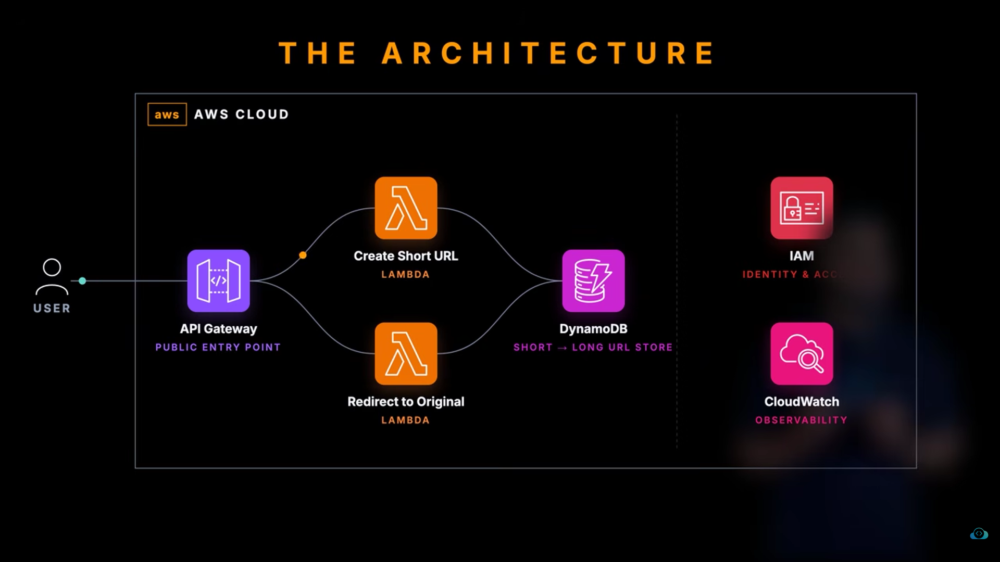
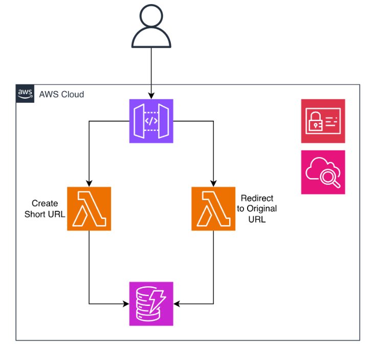

# AWS Serverless URL Shortener

A production-grade, fully serverless URL shortening service built on AWS. Users can shorten any long URL with an auto-generated or custom short ID and get redirected instantly via a `301` response. The project is extended with analytics, caching, notifications, frontend hosting, monitoring, and CI/CD to demonstrate real-world cloud architecture skills.

---

## Architecture (Core)

```
Client
  │
  ▼
Amazon Route 53  ──►  CloudFront (CDN + HTTPS)
                            │
                    ┌───────┴────────┐
                    │                │
              S3 (Frontend)    API Gateway (REST API + WAF + API Key)
                                     │
                          ┌──────────┴──────────┐
                          │                     │
                   POST /create            GET /{id}
                          │                     │
                   Lambda 1 (Create)     Lambda 2 (Redirect)
                          │                     │
                          └──────────┬──────────┘
                                     │
                                 DynamoDB
                                     │
                              ┌──────┴──────┐
                              │             │
                           DynamoDB      DynamoDB
                            Streams        TTL
                              │
                           Lambda 3
                         (Analytics)
                              │
                    ┌─────────┴──────────┐
                    │                    │
              CloudWatch              SNS Topic
             (Metrics/Logs)         (Email Alerts)
```



---

## AWS Services Used

| Service | Role |
|---|---|
| **AWS Lambda** | Serverless compute — create URL, redirect, and analytics processing |
| **Amazon API Gateway** | REST API with API key auth, usage plans, and throttling |
| **Amazon DynamoDB** | NoSQL store mapping short IDs → original URLs with TTL |
| **DynamoDB Streams** | Captures every write event to trigger analytics Lambda |
| **Amazon S3** | Hosts the static frontend (HTML/CSS/JS) |
| **Amazon CloudFront** | CDN for low-latency global delivery of frontend and API |
| **Amazon Route 53** | Custom domain DNS routing to CloudFront |
| **AWS Certificate Manager (ACM)** | Free SSL/TLS cert for custom domain (HTTPS) |
| **Amazon SNS** | Sends email/SMS notification when a new URL is created |
| **Amazon SQS** | Decouples high-volume create requests for reliable async processing |
| **AWS WAF** | Web Application Firewall — blocks bots, enforces rate limits per IP |
| **Amazon Cognito** | User pool for authenticated URL management (owner-only delete) |
| **AWS Secrets Manager** | Stores API keys and config securely, injected into Lambda at runtime |
| **Amazon CloudWatch** | Logs, metrics dashboards, and alarms for Lambda and DynamoDB |
| **AWS X-Ray** | Distributed tracing across API Gateway and Lambda |
| **AWS IAM** | Least-privilege execution roles for every Lambda function |
| **AWS SAM / CloudFormation** | Infrastructure as Code — entire stack deployable with one command |

---

## Features

- Shorten any URL with a randomly generated 6-character alphanumeric ID
- Optionally specify a **custom short ID** (e.g. `kk` → `/prod/kk`)
- **Conflict detection** — returns `409` if a custom ID is already taken
- **301 redirect** for fast, cache-friendly browser redirection
- **Link expiry** via DynamoDB TTL — links auto-delete after a configurable number of days
- **Click analytics** — every redirect is counted via DynamoDB Streams + Lambda
- **Email notifications** via SNS when a new short URL is successfully created
- **Frontend UI** hosted on S3 + CloudFront — no `curl` needed
- **Custom domain** with HTTPS via Route 53 + ACM
- **WAF protection** against bot abuse and DDoS at the API layer
- **Full observability** — CloudWatch dashboards + X-Ray traces

---

## Lambda Functions

### `lambda1.py` — Create Short URL
- Accepts `POST /create` with JSON body `{ "url": "...", "custom_id": "..." }`
- Generates a random 6-char ID if no custom ID is provided
- Writes to DynamoDB with a conditional put to prevent ID collisions
- Publishes an SNS notification on successful creation
- Returns the short ID and original URL

### `lambda2.py` — Redirect
- Accepts `GET /{id}`
- Looks up the short ID in DynamoDB
- Returns a `301 Location` redirect to the original URL
- Returns `404` if the ID does not exist

### `lambda3.py` — Analytics Processor *(extended)*
- Triggered by DynamoDB Streams on every redirect event
- Increments a `click_count` atomic counter on the item
- Publishes aggregate metrics to CloudWatch

---

## Extended Architecture — Additional AWS Services Explained

### 1. Amazon S3 + CloudFront (Frontend Hosting)
A static HTML/JS page is deployed to an S3 bucket configured for static website hosting. CloudFront sits in front of it as a CDN, serving the page globally with HTTPS. Users can paste a long URL into the form and get back a short link — no terminal needed.

### 2. DynamoDB Streams + Lambda 3 (Click Analytics)
Every time `lambda2.py` fetches a record for a redirect, DynamoDB Streams captures the read event and triggers `lambda3.py`. This Lambda increments a `click_count` field on the DynamoDB item using an atomic counter update, giving per-link analytics without impacting redirect performance.

### 3. Amazon SNS (Notifications)
After `lambda1.py` successfully creates a short URL, it publishes a message to an SNS topic. A subscribed email address receives a notification with the short ID and the original URL. This pattern demonstrates event-driven fan-out — the same topic could also trigger Slack webhooks or SQS queues.

### 4. Amazon SQS (Async Decoupling)
For high-traffic scenarios, the `POST /create` endpoint can drop the request onto an SQS queue instead of writing to DynamoDB synchronously. A consumer Lambda polls the queue and processes writes in batches, preventing DynamoDB throttling during traffic spikes.

### 5. AWS WAF (Security)
A WAF Web ACL is attached to the API Gateway stage with rules to:
- Rate-limit requests per IP to 100 req/5 min
- Block known bad IP reputation lists
- Reject requests with SQL injection or XSS patterns in the body

### 6. Amazon Cognito (User Auth)
A Cognito User Pool with a Lambda authorizer on API Gateway allows registered users to log in and manage their own links — view all their short URLs, delete them, or see click counts — while unauthenticated users can still use the public redirect endpoint.

### 7. AWS X-Ray (Distributed Tracing)
X-Ray is enabled on both Lambda functions and API Gateway. This produces a service map showing the full request path — API Gateway → Lambda → DynamoDB — with per-segment latency so bottlenecks can be identified in production.

### 8. CloudWatch Alarms
Alarms are configured on:
- Lambda error rate > 1% → SNS alert
- DynamoDB consumed write capacity > 80% → SNS alert
- API Gateway 5xx rate > 5% → SNS alert

---

## API Usage

**Create a short URL (random ID)**
```bash
curl -X POST https://<api-id>.execute-api.us-east-1.amazonaws.com/prod/create \
  -H "x-api-key: <YOUR_API_KEY>" \
  -H "Content-Type: application/json" \
  -d '{"url": "https://www.amazon.com"}'
```

**Create a short URL (custom ID)**
```bash
curl -X POST https://<api-id>.execute-api.us-east-1.amazonaws.com/prod/create \
  -H "x-api-key: <YOUR_API_KEY>" \
  -H "Content-Type: application/json" \
  -d '{"url": "https://kodekloud.com", "custom_id": "kk"}'
```

**Redirect using short ID**
```bash
curl -v https://<api-id>.execute-api.us-east-1.amazonaws.com/prod/kk
```

---

## Response Examples

**Success (200)**
```json
{
  "message": "URL Created",
  "short_id": "kk",
  "original_url": "https://kodekloud.com"
}
```

**Conflict (409)**
```json
{
  "error": "Custom ID 'kk' is already taken."
}
```

**Not Found (404)**
```json
"Not Found"
```

---

## Infrastructure as Code

The entire stack is defined in `template.yaml` using **AWS SAM**. Deploy with a single command:

```bash
sam build
sam deploy --guided
```

This provisions Lambda functions, API Gateway, DynamoDB table, S3 bucket, CloudFront distribution, IAM roles, SNS topic, SQS queue, and WAF rules — no manual console clicks needed.

---

## CI/CD Pipeline

A GitHub Actions workflow (`.github/workflows/deploy.yml`) runs on every push to `main`:

1. Install dependencies and run `pytest` with `moto` (DynamoDB mock)
2. `sam build`
3. `sam deploy` using stored AWS credentials from GitHub Secrets
4. Post deployment URL as a comment on the PR

---

## Future Improvements

| Enhancement | Service / Tool | Value |
|---|---|---|
| QR code generation for each short link | Lambda + Pillow + S3 | User-facing feature |
| Link preview (unfurl metadata) | Lambda + BeautifulSoup | Better UX |
| Geographic analytics (country of click) | CloudFront logs + Athena | Data engineering angle |
| Multi-region active-active | DynamoDB Global Tables + Route 53 latency routing | High availability |
| Abuse detection (malicious URL scan) | Lambda + VirusTotal API | Security layer |
| Serverless dashboard UI | React + Amplify | Full-stack depth |

---

## Screenshots

| Architecture | Live Demo |
|---|---|
|  |  |

---

## License

MIT
